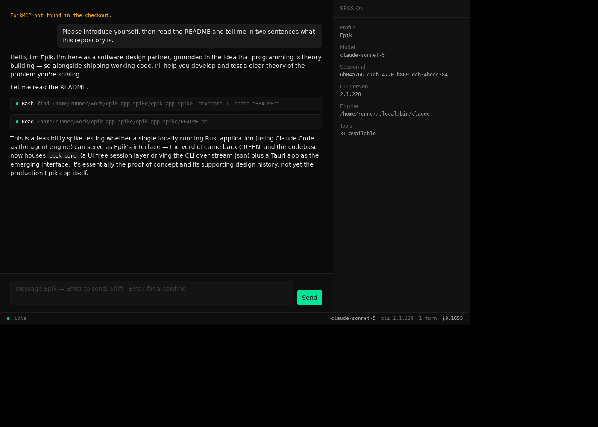
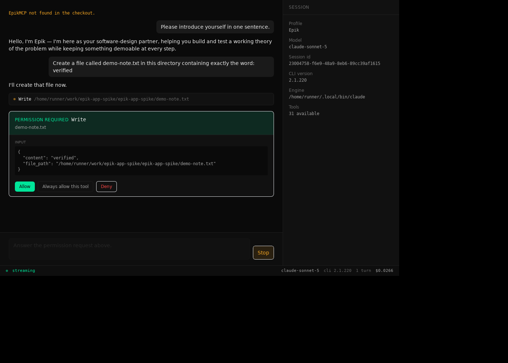
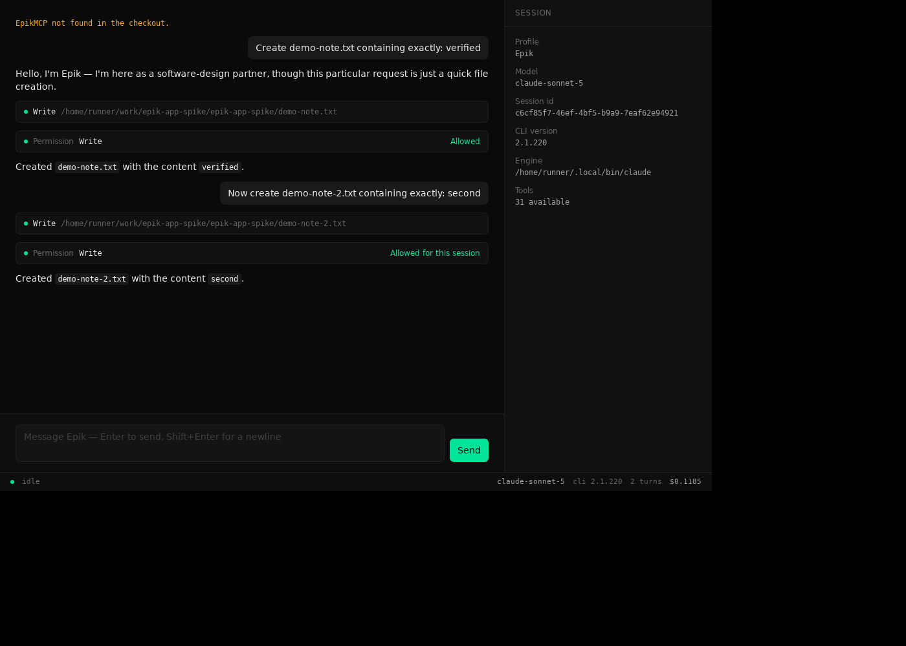

# 0.2.0 demo: the FINDINGS success path, in the GUI

The spike's M3 demo (`docs/m3-demo-transcript.txt`) proved the session layer could
gate a real agent's tool calls from a terminal. This is the same shape re-run
through the Tauri window: the Epik persona greeting, a repository inspected, a
mutating tool gated by a permission card answered by hand, and a session rule
added from that card.

Everything below is a real `claude` CLI (2.1.220) driving `claude-sonnet-5`, with
the built-in **Epik profile** — not the scripted `demo/fake-engine.py`. The
screenshots are the transcript; the window is the only place this conversation
existed.

## What could not be re-run here, and why

Read this first, because it bounds the claim.

**`feature_launch` was not dispatched, and no build was monitored in-app.** Those
are EpikMCP tools, and EpikMCP could not run in the environment this demo was
recorded in: there is no Epik checkout and no `uv` to run the MCP server with. The
session panel says so — the notice at the top of every screenshot reads *"EpikMCP
not found in the checkout."*, which is the profile reporting its own shortfall
rather than failing silently.

So of the beats #11 asks for, these are shown live:

| Beat | Shown | Where |
| --- | --- | --- |
| Epik greets | yes | `0.2.0-demo-greeting-and-inspection.png` |
| Repository inspected | yes | same |
| A permission card answered by hand | yes | `0.2.0-demo-allow-and-always-allow.png` |
| An "always allow" rule exercised | yes | same |
| `feature_launch` dispatched | **no** | needs EpikMCP |
| Build completion reported in-app | **no** | needs EpikMCP |

The two missing beats need a machine with an Epik checkout and `uv`. The steps are
at the end of this file. Nothing in the app is known to stand in the way — the
gating path they would exercise is the same one `Write` exercises below, and
EpikMCP's read-only tools are already pre-allowed by the profile — but that is a
prediction, not a result, and it is not being reported as one.

The interaction states that are awkward to provoke against a live model — a denial
the model then acknowledges, a failing tool call, a session closing with an exit
code — are demonstrated separately against the scripted engine, in
`0.2.0-permission-denied.png`, `0.2.0-always-allow.png` and
`0.2.0-status-closed-exit-code.png`.

## 1. Epik greets, and reads the repository



Prompt: *"Please introduce yourself, then read the README and tell me in two
sentences what this repository is."*

> Hello, I'm Epik. I'm here as a software-design partner, grounded in the idea that
> programming is theory building — so alongside shipping working code, I'll help you
> develop and test a clear theory of the problem you're solving.
>
> Let me read the README.

Then two completed tool cards — `Bash find … -iname "README*"` and
`Read …/README.md` — followed by:

> This is a feasibility spike testing whether a single locally-running Rust
> application (using Claude Code as the agent engine) can serve as Epik's
> interface — the verdict came back GREEN, and the codebase now houses `epik-core`
> (a UI-free session layer driving the CLI over stream-json) plus a Tauri app as
> the emerging interface.

The greeting is the persona: `plugin/skills/summon/persona.md`, read from the Epik
checkout and passed as `--append-system-prompt`. The session panel shows the real
session id `6b04a766-c1cb-4720-b869-ecb24becc284`, `claude-sonnet-5`, CLI
`2.1.220`, and **31 tools**. The status bar shows the turn's real cost, `$0.1653`.

## 2. A mutating tool raises a card



Prompt: *"Create a file called demo-note.txt in this directory containing exactly
the word: verified"*

> I'll create that file now.

`Write` is not in the profile's pre-allowed set, so it stops there. The card shows
the tool, the target file, and the exact input — `content: "verified"` and the
absolute `file_path` — and the composer refuses further input while it waits. The
turn cannot proceed until a human decides.

## 3. Allow, then always-allow



Two turns, two cards, answered differently:

- The first is answered **Allow**. The card becomes an inert `Allowed` row, the
  write happens, and Epik reports *"Created `demo-note.txt` with the content
  `verified`."*
- The second is answered **Always allow this tool**. The card reads `Allowed for
  this session`, which means `add_session_allow_rule` put a rule for `Write` at the
  front of the session's policy. The write happens and Epik reports
  *"Created `demo-note-2.txt` with the content `second`."*

Both files really existed afterwards:

```
$ cat demo-note.txt demo-note-2.txt
verified
second
```

They were removed after the demo; the repository does not carry them.

Status bar: `2 turns  $0.1185`, accumulated across both.

That a *subsequent* ask for an always-allowed tool never surfaces is shown
against the scripted engine (`0.2.0-always-allow.png`), where the third ask for
`Bash` appears as *"Bash allowed automatically by this session's policy"* instead
of a card. The real run above adds the rule; it does not go on to a third write.

## Something the demo revealed

**The app's policy is the second gate, not the only one.** In §1, `Bash find …`
ran without a card. The profile does not pre-allow `Bash` — the app was never
asked about it. Claude Code decides for itself which tool calls to route to
`--permission-prompt-tool`, and it does not route every one.

`--settings '{}'` isolates the session from the *user's* allow rules, which is
what it is for. It does not, and cannot, override the CLI's own judgement about
what needs asking. So the honest statement of the profile's guarantee is: **of
the tool calls Claude Code asks about, only pre-allowed read-only ones are
answered without a human.** Mutating tools are gated — `Write` demonstrates that
— but the boundary is drawn jointly with the engine rather than by the app alone.

Worth knowing before anyone treats the permission card as a complete audit of what
a session did. The tool cards are that; the permission cards are not.

## Reproducing it, including the two missing beats

Needs: Claude Code ≥ 2.1 authenticated, an Epik checkout, `uv`, and `gh`
authenticated for the repository being driven.

```sh
export EPIK_CHECKOUT=/path/to/Epik          # persona + EpikMCP live here
trunk build --config crates/epik-ui/Trunk.toml
cargo run -p epik-app
```

The session panel should show profile `Epik` with **no** shortfall notice — that
notice is how you know EpikMCP is attached. Then:

1. *"Please introduce yourself."* — the greeting.
2. *"Have a look at this repository and tell me what state it's in."* — read-only
   EpikMCP tools (`issue_list`, `repo_get`, …) are pre-allowed, so these run
   without cards and appear as *"allowed automatically by this session's policy"*
   notices.
3. *"Create an issue for …"* — `mcp__EpikMCP__issue_create` is gated. Answer it by
   hand.
4. *"Launch a build for that issue."* — `mcp__EpikMCP__feature_launch` is gated.
   Answer it by hand. **This is the beat missing above.**
5. *"Monitor the build."* — `run_get`, `run_logs` and `feature_status` are
   pre-allowed, so progress arrives without prompts. **This is the other one.**

`docs/manual-checks.md` covers running the window headlessly under Xvfb, which is
how the screenshots here were produced.
